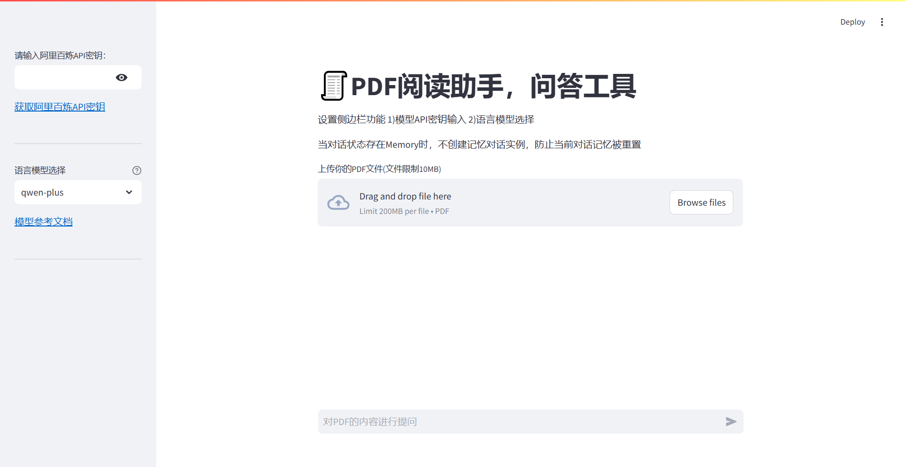

# PDF Q&A Tools

[中文](README_zh.md) | [English](README.md)

- Due to the need to use the LLM model as well as the text coding model, the Ali Bailian platform with two models is used
- Input your **APIKEY** and Upload PDF files and ask questions about files
## Introduction
This project mainly uses Langchain and streamlit to implement file questions.
You can choose the models in qwen-max, qwen-plus, qwen-turbo, what about these models you could
find in  [阿里云百炼](https://help.aliyun.com/zh/model-studio/user-guide/text-generation/?spm=a2c4g.2712809.0.0.72731507x6iuVp)  
    
You could creat APIKEY in the web [百炼API](https://bailian.console.aliyun.com/?apiKey=1#/api-keyw)    
  
## RAG（Retrieval Augmented Generation）

The step of RAG :
1. load file
2. split the file
3. embeding the text
4. add the file in Vector database
5. use LLM model cahin to retriever and output

## Start

- Use the `cd` command in the terminal to enter the project

```bash
streamlit run .\main.py
```

## Inference



