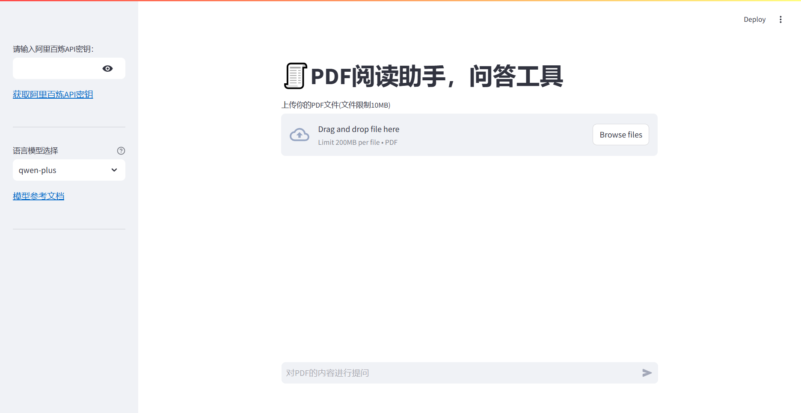

# PDF问答工具
- 由于需要使用 LLM 模型和文本编码模型，因此使用了具有两种模型的阿里云百炼平台  
- 输入您的 APIKEY 并上传 PDF 文件并询问有关文件的问题

## 介绍

本项目主要使用 Langchain 和 streamlit 实现PDF问答。
你可以选择 qwen-max、qwen-plus、qwen-turbo 中的模型，这些模型的介绍你可以查看
以下链接  [阿里云百炼](https://help.aliyun.com/zh/model-studio/user-guide/text-generation/?spm=a2c4g.2712809.0.0.72731507x6iuVp)    
  
API创建网址 [百炼API](https://bailian.console.aliyun.com/?apiKey=1#/api-keyw)  


## 检索增强生成——RAG（Retrieval Augmented Generation）

RAG 的步骤 :
1. 加载文件
2. 分割文件
3. 对分割后的文件进行嵌入编码
4. 将文本的嵌入向量存入向量数据库
5. 结合大模型和文本检索输出回答

## 启动

- 使用 `cd` 进入文件进入项目根目录，输入以下命令

```bash
streamlit run .\main.py
```

## 界面

